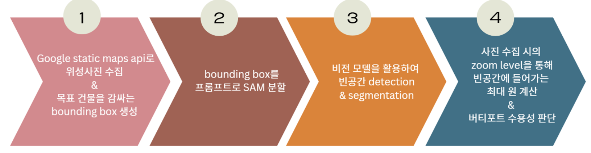

# Vision 기반 건물 옥상 가용 면적 추정

## 프로젝트 소개
건물 옥상의 빈 공간 검출을 통해 UAM 버티포트 수용성 판단 프로젝트

## 프로젝트 구조
- `데모/` : 모델 결과 시각화 코드 

- `모델학습/`: 건물 옥상의 빈공간 검출을 위한 3가지 딥러닝 모델의 구현 코드
  - `MaskRCNN/`: Mask R-CNN 모델 구현 및 관련 코드
  - `Yolo/`: YOLO 모델 구현
  - `SAM/`: SAM 모델 구현

- `분할/` : 수집된 건물 위성 이미지에서 해당 건물 옥상 부분만 분할

- `이미지수집/` : 건물 위성 이미지 수집 코드

- `image_dataset/` : 모델학습 및 분할에 사용되는 이미지 데이터셋
  - `모델학습/`: 딥러닝 모델의 Fine-tuning을 위한 레이블링한 데이터셋
  - `분할/`: SAM을 이용한 건물 분할에 사용되는 데이터셋 및 원본 이미지

## 데이터셋 레이블링
현재 데이터셋 레이블링은 수동으로 진행됨  
빈공간만을 레이블링 하여 모델학습 데이터셋 구성  

## Workflow

1. 데이터 수집 (이미지 수집)
2. SAM 이용 분할 (분할)
3. 비전 모델을 활용하여 빈공간 detection (모델학습)
4. 버티포트 수용성 판단 (데모)
